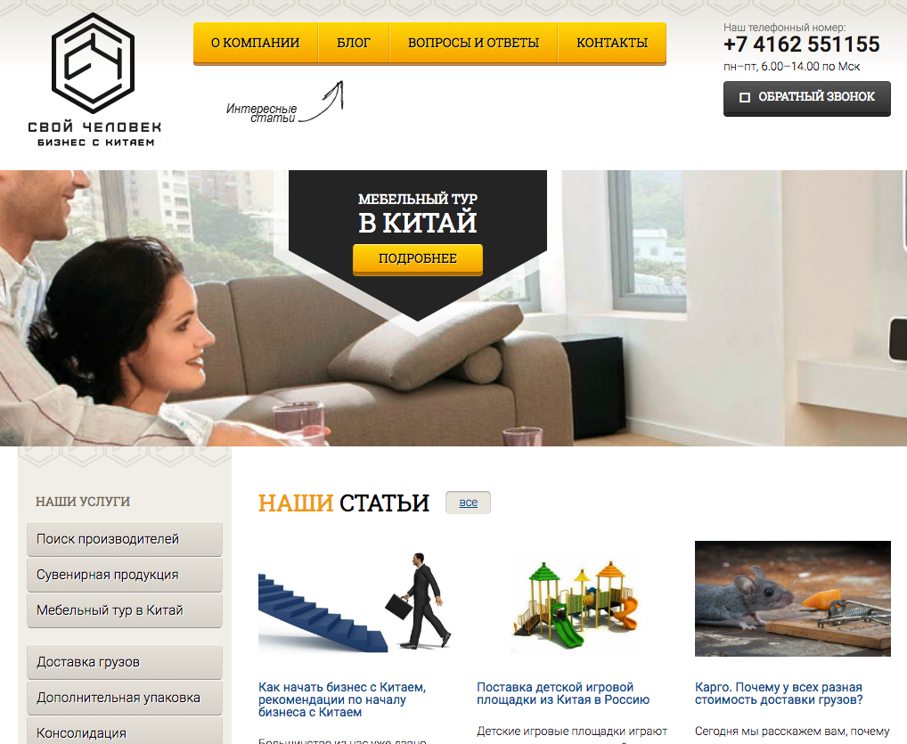
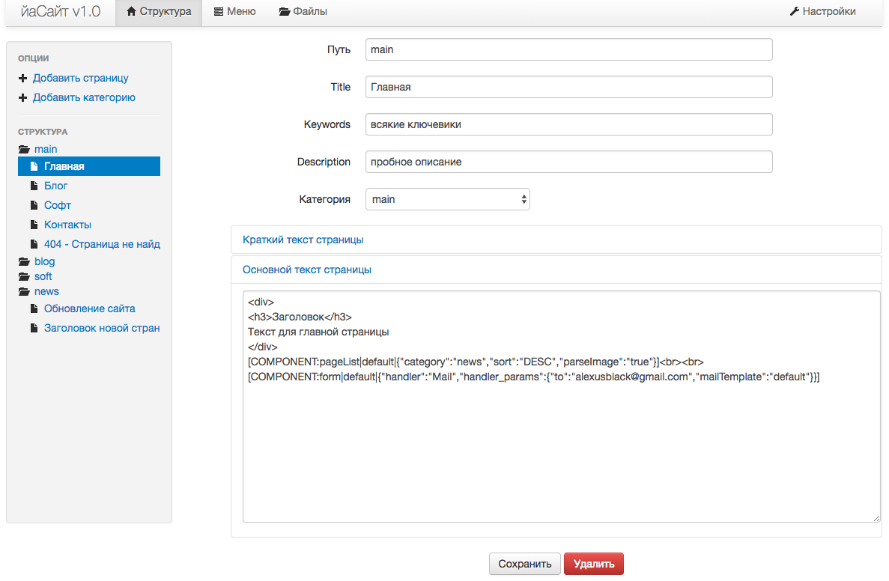

# alexusEngine
Website CMS I developed for personal and commercial projects in 2013-14, some websites still use it and serve clients.

The CMS is written in PHP and use Smarty as templates engine. It is modular and consist of many components that can be added on global and site template level. Every component can have many templates that can completely alter it's appearance and behaviour.

CMS designed to work with Apache 2+ and mod_rewrite to have nice looking paths to pages. 

Admin panel allows to edit pages, their content stored in database, menues that are also stored in database a general settings like a side wide template. Also admin panel provides file manager so that manager can upload new resources (pictures or other media).

The engine was strogly influenced by 1C Bitrix (components system), though more modern approach of pages contents in DB was choosen, instead of pages in php files as in Bitix.

## Deployment
Copy files in root folder of your webserver, Apache2 strongly recommended. Import `siteEngine2.sql` in your database and update connection settings in `config.php`.

You can open admin panel at this path: /engine/admin , admin password can be changed at `config.php`, replace password field with md5 hash of your own password.

## Legacy

First prototype of engine can be found in v0 folder, never use it for anything =).

## Screenshots

